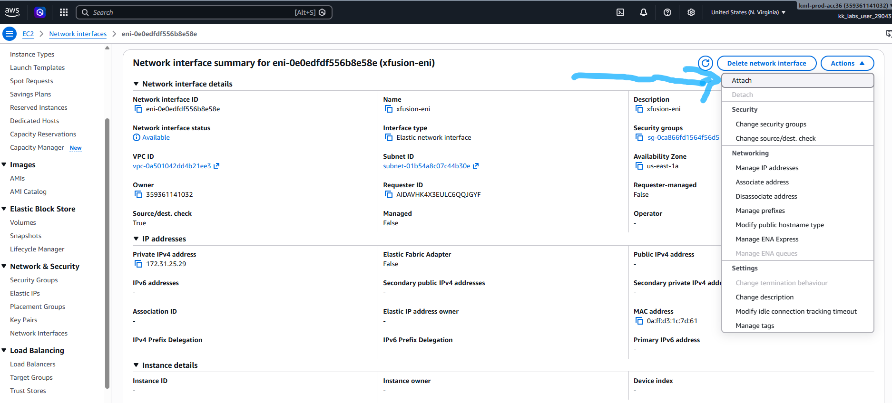
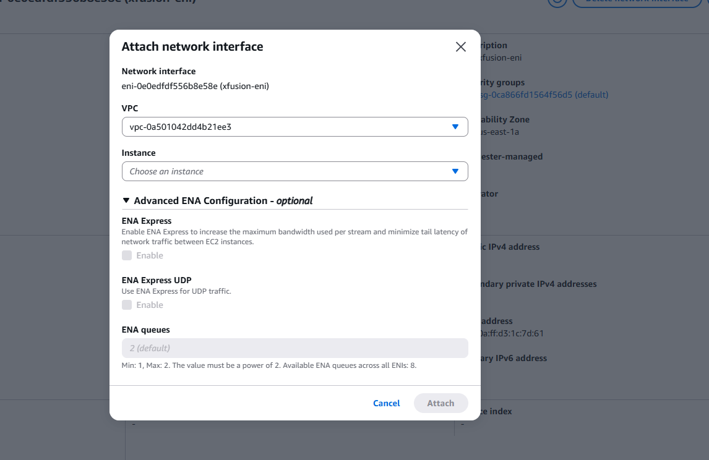

# Question
The Nautilus DevOps team has been creating a couple of services on AWS cloud. They have been breaking down the migration into smaller tasks, allowing for better control, risk mitigation, and optimization of resources throughout the migration process. Recently they came up with requirements mentioned below.
An instance named xfusion-ec2 and an elastic network interface named xfusion-eni already exists in us-east-1 region.
Attach the xfusion-eni network interface to the xfusion-ec2 instance.
Make sure status is attached before submitting the task.
Please make sure instance initialisation has been completed before submitting this task.

# Step-by-Step Solution

## 1. Navigate to EC2 Dashboard
- Log in to the **AWS Management Console**.
- Ensure the region is set to **US East (N. Virginia) us-east-1**.
- Search for and select **EC2** under Services.
- In the left navigation pane, select **Network Interfaces** under Network & Security.

## 2. Locate the Elastic Network Interface (ENI)
- In the list of network interfaces, find **xfusion-eni**.
- Note its **Network interface ID** (it will look like `eni-xxxxxxxxxxxxxxxxx`).
- Verify its **Status** is `available` and it is in the correct subnet (usually the default subnet for your VPC).

## 3. Locate the Target Instance
- In the left navigation pane, select **Instances**.
- Find the instance named **xfusion-ec2**.
- Note its **Instance ID** (it will look like `i-xxxxxxxxxxxxxxxxx`).

## 4. Stop the Instance (Required for Detach/Attach)
*Note: You must stop the instance to detach an ENI, and subsequently attach the new one.*
- Select the check box next to **xfusion-ec2**.
- Click the **Instance state** dropdown menu at the top.
- Click **Stop instance**.
- Confirm the stop action by clicking **Stop instance** again.
- Wait for the **Instance state** to change to **Stopped** and **Status checks** to show `2/2 checks passed` (initialization complete).

## 5. Detach the Current ENI (If Attached)
- Go back to **Network Interfaces** in the left navigation pane.
- Select the network interface currently attached to `xfusion-ec2` (it will have a "Description" pointing to your instance).
- Click **Actions** > **Detach network interface**.
- Confirm the detachment.

## 6. Attach the New ENI
- Select the target network interface **xfusion-eni** (ensure its status is `available`).
- Click **Actions** > **Attach network interface**.
- In the dialog box:
    - **Instance**: Enter the Instance ID of `xfusion-ec2`.
    - **Device index**: Enter `1` (Since `0` is typically used by the primary ENI).
    - *(Optional)* **Secondary private IP address**: You can assign one if required, but for this task, the default is usually sufficient.
- Click **Attach network interface**.
- Verify the **Status** changes to `in-use` and **Description** shows the `xfusion-ec2` instance ID.

## 7. Start the Instance
- Navigate back to **Instances**.
- Select **xfusion-ec2**.
- Click **Instance state** > **Start instance**.
- Wait for the instance to **Run** and complete checks.

## Verification
Check the **Details** tab for `xfusion-ec2`. Verify:
- **Network interfaces**: Should show two entries (one for `eth0` and one for `eth1`).
- The ENI `xfusion-eni` should be listed as attached.