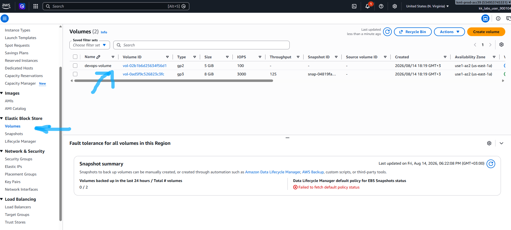
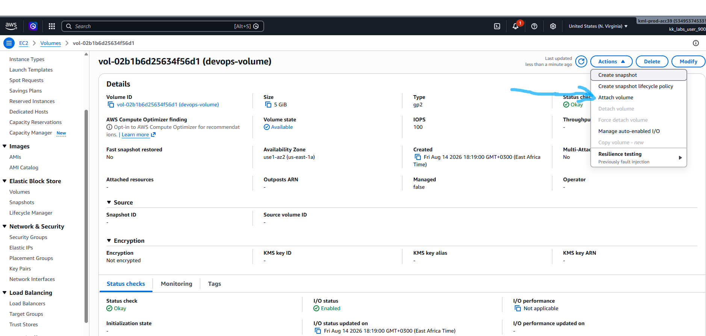
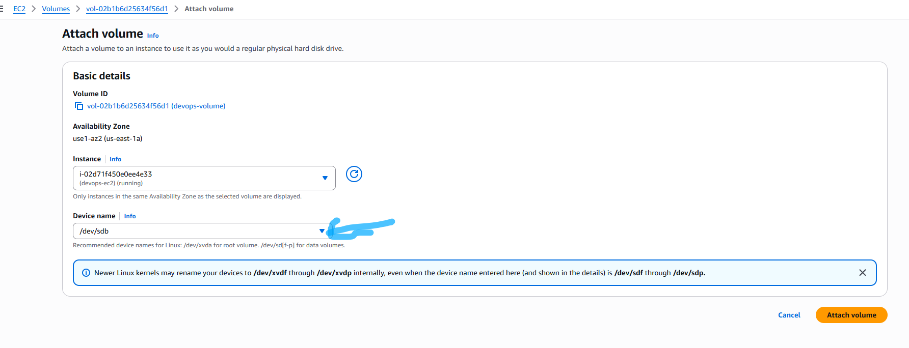
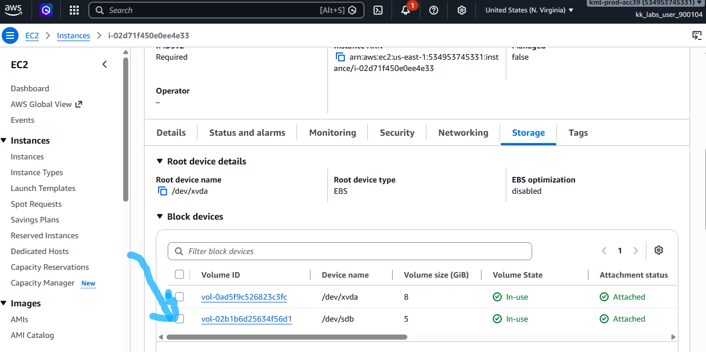

# Question

The Nautilus DevOps team has been creating a couple of services on AWS cloud. They have been breaking down the migration into smaller tasks, allowing for better control, risk mitigation, and optimization of resources throughout the migration process. Recently they came up with requirements mentioned below.

An instance named **devops-ec2** and a volume named **devops-volume** already exists in **us-east-1** region. Attach the **devops-volume** volume to the **devops-ec2** instance, make sure to set the device name to **/dev/sdb** while attaching the volume.

# Step-by-step Solution

## Option 1: Using the AWS Management Console

### Select Region & Locate Volume:

- Log in to the AWS Management Console.
- Confirm the top-right region selector is set to **US East (N. Virginia) us-east-1**.
- Navigate to **EC2 > Elastic Block Store > Volumes**.

- Find and select the volume named **devops-volume**.

### Initiate Volume Attachment:

- Click the **Actions** dropdown menu at the top right.
- Select **Attach volume**.


### Configure Instance & Device Name:

- In the **Instance** field, select **devops-ec2**.

- In the **Device name** field, type **/dev/sdb**.
- Click **Attach volume**.

### Confirm Attachment:
- Verify the **Status** changes to `in-use` and **Device** shows `/dev/sdb`.


## Option 2: Using the AWS CLI

Run the following commands to retrieve the instance and volume IDs automatically and perform the attachment:Bash

# 1. Retrieve the Instance ID for devops-ec2
```bash
INSTANCE_ID=$(aws ec2 describe-instances \
  --region us-east-1 \
  --filters "Name=tag:Name,Values=devops-ec2" "Name=instance-state-name,Values=running,stopped" \
  --query "Reservations[0].Instances[0].InstanceId" \
  --output text)
```

# 2. Retrieve the Volume ID for devops-volume
```bash
VOLUME_ID=$(aws ec2 describe-volumes \
  --region us-east-1 \
  --filters "Name=tag:Name,Values=devops-volume" \
  --query "Volumes[0].VolumeId" \
  --output text)
```
# 3. Attach the volume to the instance as /dev/sdb
```bash
aws ec2 attach-volume \
  --region us-east-1 \
  --volume-id $VOLUME_ID \
  --instance-id $INSTANCE_ID \
  --device /dev/sdb
```

## Verification

To verify that the volume is successfully attached:

AWS Console: Select devops-volume in the Volumes list and check that its state displays in-use with attachment information pointing to devops-ec2 as /dev/sdb.

AWS CLI:Bash
```bash
aws ec2 describe-volumes \
  --region us-east-1 \
  --volume-ids $VOLUME_ID \
  --query "Volumes[0].Attachments[0].[State, Device, InstanceId]" \
  --output text
```
The returned output should show `attached`, `/dev/sdb`, and the correct instance ID.