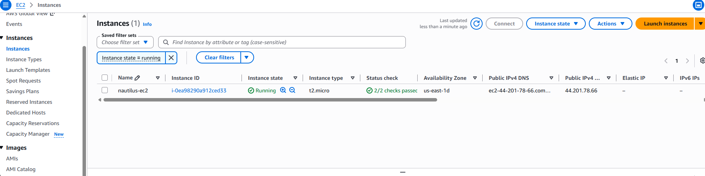
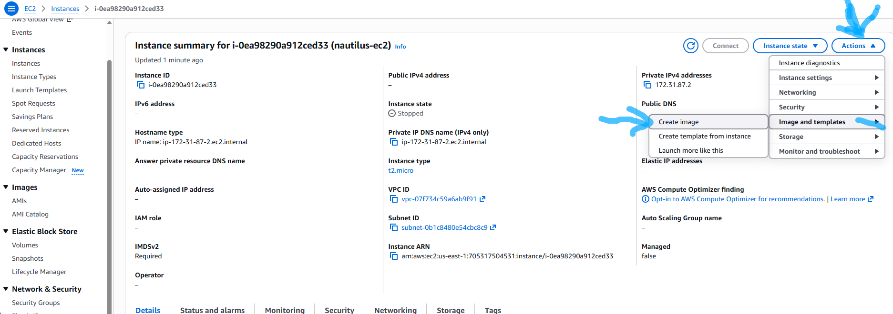
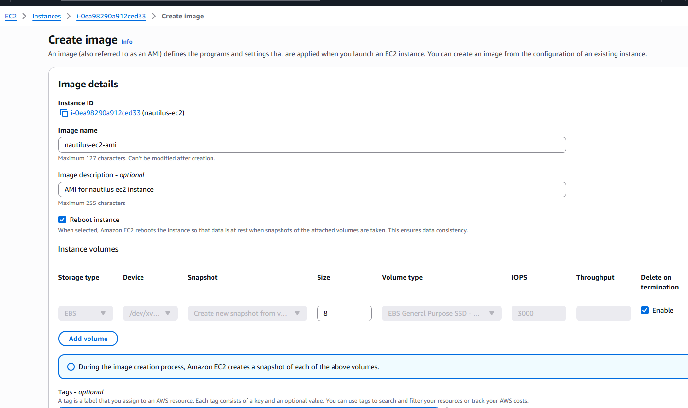
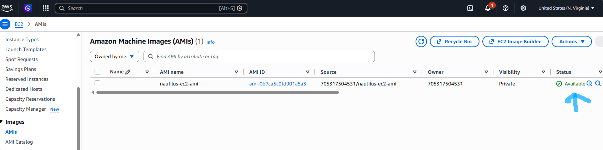

# Question

The Nautilus DevOps team is strategizing the migration of a portion of their infrastructure to the AWS cloud. Recognizing the scale of this undertaking, they have opted to approach the migration in incremental steps rather than as a single massive transition. To achieve this, they have segmented large tasks into smaller, more manageable units. This granular approach enables the team to execute the migration in gradual phases, ensuring smoother implementation and minimizing disruption to ongoing operations. By breaking down the migration into smaller tasks, the Nautilus DevOps team can systematically progress through each stage, allowing for better control, risk mitigation, and optimization of resources throughout the migration process.
- For this task, create an AMI from an existing EC2 instance named `nautilus-ec2` with the following requirement:
  - Name of the AMI should be `nautilus-ec2-ami`,
  - make sure AMI is in `available` state.

  # Step by step Solution

  ## Option 1: Using the AWS Management Console

### 1. Locate the Source Instance:

***AWS Console.***

- Log in to the AWS Management Console.
- Confirm you are in the correct AWS region (e.g., us-east-1).
- Navigate to **EC2 > Instances**.Select the instance named **nautilus-ec2**.


### 2. Initiate AMI Creation:

***Actions Menu.***

- Click the **Actions** dropdown menu at the top.
- Select **Image and templates > Create image**.


### 3. Configure Image Details:

***Configuration.***

- Image name: Enter **nautilus-ec2-ami**.
- (Optional) Enter a brief description if desired.
- Leave **No reboot** unchecked to ensure file system consistency (unless specified otherwise).
- Click **Create image**.


### 4. Wait for Available State:

***Status Check.***

- In the left navigation pane under **Images**, click **AMIs**.
- Locate **nautilus-ec2-ami**.
- Monitor the **Status** column until it transitions from **pending** to **available**.


## Option 2: Using the AWS CLI

Run the following commands to create the AMI and wait until its status turns available:Bash

# 1. Retrieve the Instance ID for nautilus-ec2

```Bash
INSTANCE_ID=$(aws ec2 describe-instances \
  --filters "Name=tag:Name,Values=nautilus-ec2" "Name=instance-state-name,Values=running,stopped" \
  --query "Reservations[0].Instances[0].InstanceId" \
  --output text)
```

# 2. Create the AMI

```Bash
IMAGE_ID=$(aws ec2 create-image \
  --instance-id $INSTANCE_ID \
  --name "nautilus-ec2-ami" \
  --description "AMI created from nautilus-ec2" \
  --query "ImageId" \
  --output text)
```

# 3. Wait until the AMI reaches the 'available' state
```Bash
aws ec2 wait image-available --image-ids $IMAGE_ID
```


# Verification

Confirm the creation and status of the AMI:

- AWS Console: Check EC2 > AMIs and verify that nautilus-ec2-ami exhibits a status of available.
- AWS CLI: 
```Bash
aws ec2 describe-images --image-ids $IMAGE_ID --query "Images[0].State" --output text
```
The returned output will be available.