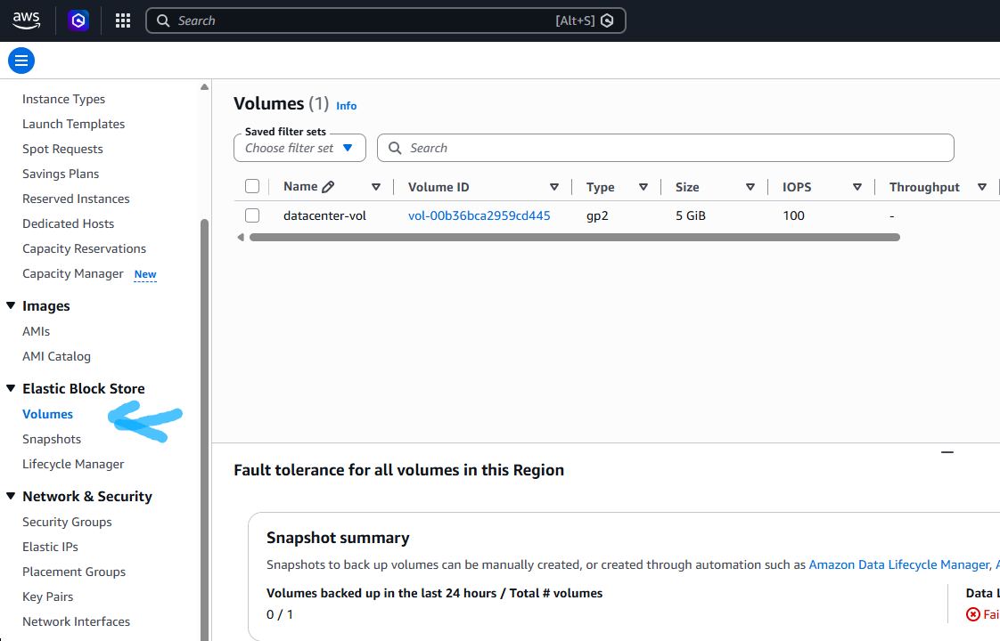
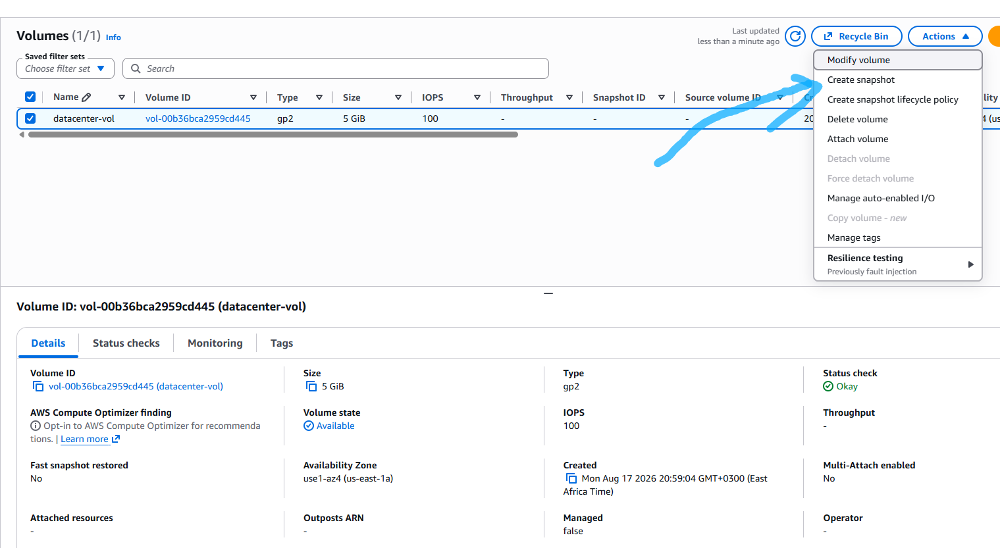
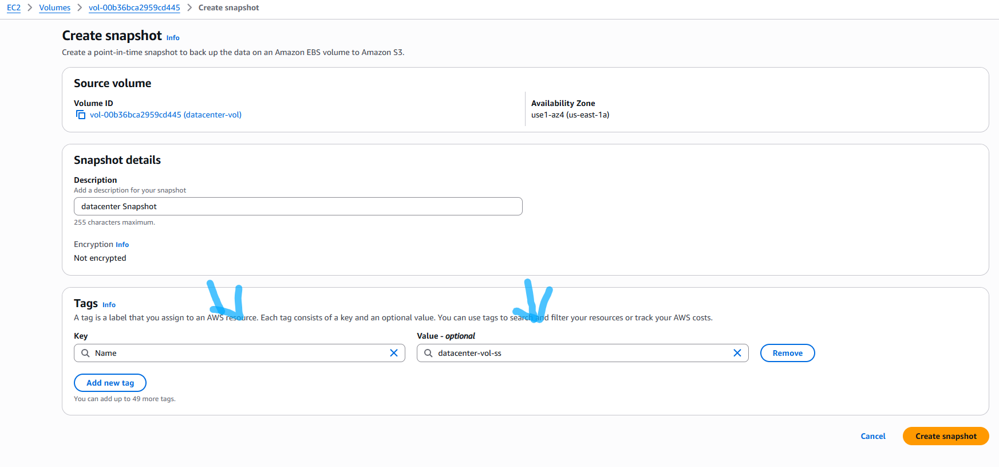
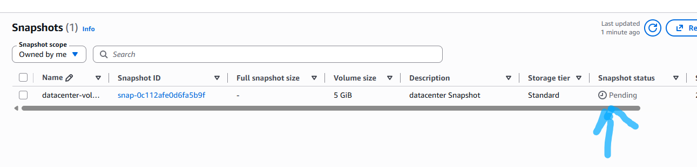

# Question

The Nautilus DevOps team has some volumes in different regions in their AWS account. They are going to setup some automated backups so that all important data can be backed up on regular basis. For now they shared some requirements to take a snapshot of one of the volumes they have.
Create a snapshot of an existing volume named `datacenter-vol` in `us-east-1` region.
1) The name of the snapshot must be `datacenter-vol-ss`.
2) The description must be `datacenter Snapshot`.
3) Make sure the snapshot status is `completed` before submitting the task.

# Step by Step solution

## Option 1: Using the AWS Management Console

### Step 1: Select Region & Locate Volume:

**AWS Console.**

Log in to the AWS Management Console.

Confirm the top-right region selector is set to US East (N. Virginia) us-east-1.

Navigate to EC2 > Elastic Block Store > Volumes.

Find and select the volume named datacenter-vol.

### Step 2: Initiate Snapshot Creation:

**Actions Menu.**

Click the Actions dropdown menu at the top right.

Select Create snapshot.


### Step 3: Set Description and Tags:

**Configuration**

Description: Enter datacenter Snapshot.

Under Tags, click Add tag.

Set Key to Name.

Set Value to datacenter-vol-ss.

Click Create snapshot.


### Step 4: Wait for Completed State:

**Status Check**

In the left navigation pane under Elastic Block Store, click Snapshots.

Locate datacenter-vol-ss.

Monitor the Status column until it transitions from pending to completed (100%).


### Option 2: Using the AWS CLI


```Bash
# 1. Retrieve the Volume ID for datacenter-vol in us-east-1
VOLUME_ID=$(aws ec2 describe-volumes \
  --region us-east-1 \
  --filters "Name=tag:Name,Values=datacenter-vol" \
  --query "Volumes[0].VolumeId" \
  --output text)

# 2. Create the snapshot with the specified description and Name tag
SNAPSHOT_ID=$(aws ec2 create-snapshot \
  --region us-east-1 \
  --volume-id $VOLUME_ID \
  --description "datacenter Snapshot" \
  --tag-specifications 'ResourceType=snapshot,Tags=[{Key=Name,Value=datacenter-vol-ss}]' \
  --query "SnapshotId" \
  --output text)

# 3. Wait until the snapshot status is 'completed'
aws ec2 wait snapshot-completed \
  --region us-east-1 \
  --snapshot-ids $SNAPSHOT_ID
```
### Verification


To confirm the snapshot creation and its status:

AWS Console: Check EC2 > Snapshots and verify that datacenter-vol-ss has a status of Completed.

AWS CLI:

```Bash
aws ec2 describe-snapshots \
  --region us-east-1 \
  --snapshot-ids $SNAPSHOT_ID \
  --query "Snapshots[0].State" \
  --output text
```


The returned output will be completed.